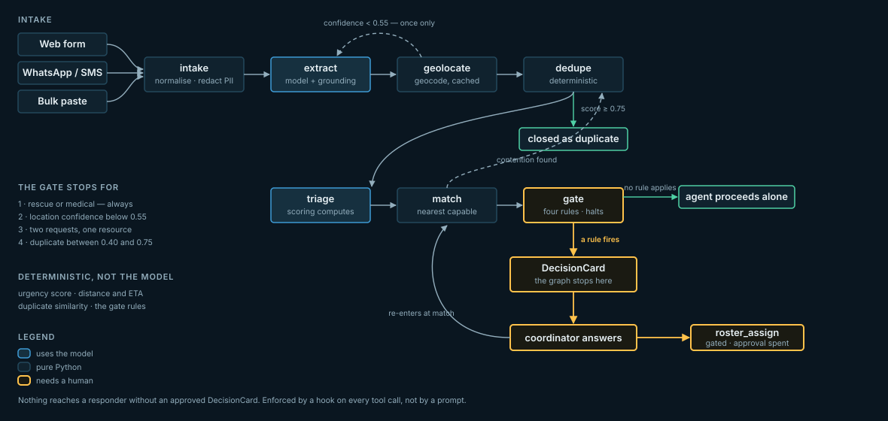
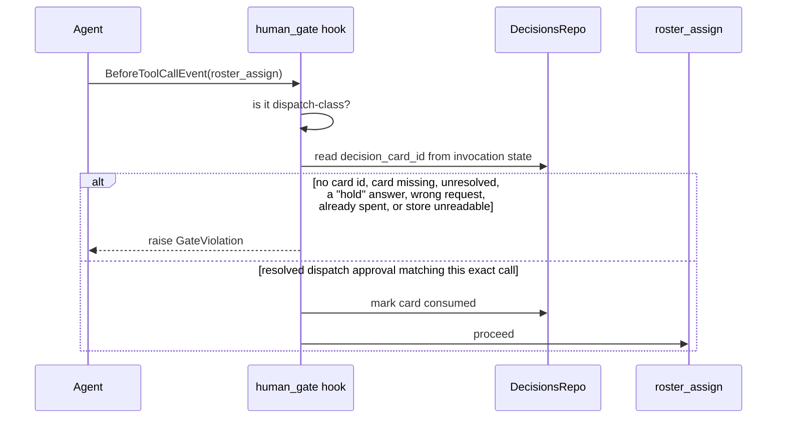

# Architecture



SVG rather than PNG: it is vector, renders on GitHub, and is a fraction of
the size. Rasterising the mermaid source below would have needed a
headless-Chromium download this machine's ~50 KB/s link could not justify.
The mermaid source is kept as the machine-readable description.

## The pipeline

```mermaid
flowchart LR
  subgraph intake_layer["Intake"]
    FORM[Web form]
    WA[WhatsApp / SMS webhook]
    BULK[Bulk paste]
  end

  FORM --> INTAKE
  WA --> INTAKE
  BULK --> INTAKE

  INTAKE["intake<br/><i>pure Python</i><br/>normalise + redact PII"]
  EXTRACT["extract<br/><i>model</i><br/>ExtractedNeed + grounding"]
  GEO["geolocate<br/><i>model + geocode tool</i>"]
  DEDUPE["dedupe<br/><i>deterministic similarity</i>"]
  TRIAGE["triage<br/><i>scoring.py computes,<br/>model explains</i>"]
  MATCH["match<br/><i>nearest capable resource</i>"]
  GATE["gate<br/><i>pure Python</i><br/>four rules"]

  INTAKE --> EXTRACT
  EXTRACT --> GEO
  GEO -->|"confidence &lt; 0.55<br/>once only"| EXTRACT
  GEO --> DEDUPE
  DEDUPE -->|"score &ge; 0.75"| CLOSED["closed as duplicate"]
  DEDUPE --> TRIAGE
  TRIAGE --> MATCH
  MATCH -->|"contention found"| DEDUPE
  MATCH --> GATE

  GATE -->|"no rule applies"| AUTO["agent proceeds alone"]
  GATE -->|"rule fires"| CARD["DecisionCard<br/><b>graph halts</b>"]
  CARD --> HUMAN(["coordinator answers"])
  HUMAN -->|"re-enters at match"| MATCH
  HUMAN -->|"approved dispatch"| ASSIGN["roster_assign<br/><i>gated</i>"]
```



## The gate

Four hard-coded rules in `agent/nodes/gate.py`. Any one of them halts the run and
writes a card.

| # | Rule | Card kind |
|---|---|---|
| 1 | Need is `rescue` or `medical` — always, whatever the confidence | `life_safety` |
| 2 | Location confidence below 0.55 after the one retry | `low_confidence_location` |
| 3 | Two or more open requests matched to the same resource | `resource_conflict` |
| 4 | Duplicate score between 0.40 and 0.75 | `possible_duplicate` |

Contention is checked before life-safety: when two rescues want one boat, the
useful question is *which one*, not *may I send someone*.

## The human gate



The check is repeated inside `roster.assign` itself, so a direct call from a
service or a test cannot slip past the hook.

## Layers

| Layer | Where | Notes |
|---|---|---|
| API | `api/` | FastAPI, Pydantic v2 at every boundary, SSE at `/stream` |
| Orchestration | `services/pipeline.py` | The only caller of `agent/graph.py`; runs on a worker thread |
| Graph | `agent/graph.py` | Node sequence, retry edge, handback, halting gate |
| Nodes | `agent/nodes/` | One module each, a `run` function, no hidden state |
| Tools | `agent/tools/` | `@tool`-decorated, typed failure returns, explicit timeouts |
| Hooks | `agent/hooks/` | `human_gate`, `pii_redaction`, `audit_log` |
| Determinism | `services/scoring.py`, `geo.py`, `conflict.py` | Pure functions, table-tested |
| Store | `store/` | Single table, two backends (memory, DynamoDB) |

## Storage layout

```
PK=REQ#{id}            SK=META | NEED | GEO | MATCH
PK=RES#{id}            SK=META
PK=DEC#{id}            SK=META
PK=AUDIT#{yyyy-mm-dd}  SK={ts}#{id}
PK=GEO#{norm_query}    SK=CACHE
GSI1: gsi1pk=STATUS#{status}, gsi1sk={1-urgency}#{id}
```

## Event stream

The console animates directly off these:

```json
{"type":"node_start","request_id":"r_12","node":"geolocate"}
{"type":"tool_call","request_id":"r_12","tool":"geocode","summary":"Resolving \"Mohib Banda\""}
{"type":"node_complete","request_id":"r_12","node":"geolocate","result":{"lat":34.0,"confidence":0.81}}
{"type":"decision_required","decision_id":"d_3","kind":"resource_conflict","request_ids":["r_12","r_18"]}
{"type":"request_updated","request_id":"r_12","status":"matched","urgency":0.87}
```

Subscriber queues are bounded at 500 events. A client that falls behind is told
it dropped events rather than growing the server's memory — bad wifi is the
operating condition, not the exception.

## Where the model is and is not

| Node | Model used for | Never used for |
|---|---|---|
| intake | — | — |
| extract | Reading language, mixed English/Urdu/Roman Urdu | Deciding the final facts (grounding overrides) |
| geolocate | — (tool + rules) | — |
| dedupe | — (deterministic similarity) | The verdict itself |
| triage | Explaining the score in words | The score |
| match | — (haversine + greedy) | Comparing distances |
| gate | — | Everything; it is pure Python |
